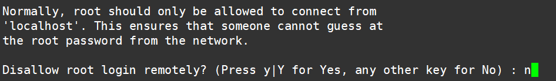

## MySQL安装与配置
## 1. 安装MySQL
- ### 安装

  ```
  dnf install mysql
  dnf install mysql-server
  ```

  启动MySQL

   ```
   systemctl start mysqld
   ```

- ### 设置MySQL自动启动

  ```
  systemctl enable --now mysqld
  ```

- ### 检查MySQL是否在运行

  ```
  systemctl status mysqld
  ```
  
  输出结果 Active：$\color{green}{active (running)}$
  
  

## 2. 安全性配置

运行mysql_secure_installation脚本，进行密码设置、允许远程连接等安全性设置。

```
mysql_secure_installation
```

1. 设置验证密码组件

   

2. 密码等级 0

   

3. 输入两遍密码 确认是否继续使用提供的密码 y

   

4. 移除匿名用户 y

   

5. 允许root远程登陆 n

   

6. 移除test数据库 y

   

7. 重新载入权限表 y

   

8. 结束

   

## 3. 设置root用户权限

从服务器登录MySQL，将root用户的host字段设为’%’，使得用户root可以从任意IP的机器上登录(若root用户的host字段为localhost,则只能本机登录)。

1. 登录MySQL

   ```
   mysql -uroot -p
   输入密码
   ```

2. 选择数据库

   ```
   use mysql;
   ```

3. host字段(主机IP)赋值

   ```
   update user set host='%' where user='root';
   ```

4. 刷新系统权限

   ```
   flush privileges;
   ```

5. 验证是否设置成功

   ```
   select user,host from user;
   ```

   结果

   

## 4. 服务器开放3306端口 (腾讯云为例)

防火墙=>添加规则=>MySQL(3306)


## 5. Navicat 连接

1. 新建连接

   

2. 填写

  
